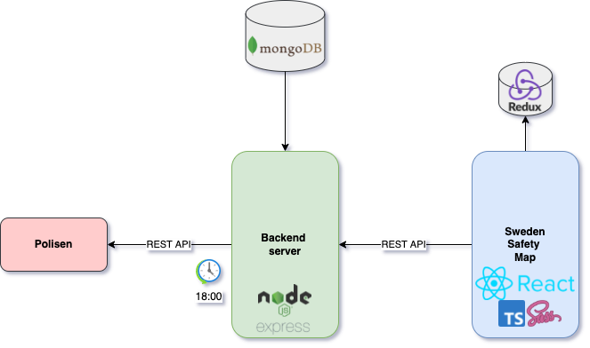

Sweden safety map is an interactive map marking all criminal incidents that took place in all over Sweden as of January 2022.



The original source of data is Polisen API. Since the data provided by the Polised API contains only last 500 incidents of all types reported by the Swedish police, I had to actively fetch new incidents to build up the state. I've created a Node.js server with implemented scheduler for calling the Polisen API every day at 18:00 and MongoDB integration for storing data. My backend server is responsible for the data manipulation which includes filtering out non-criminal types of incidents and creating summaries.

```javascript
export default axios.create({
  baseURL: "https://sleepy-thicket-06800.herokuapp.com",
});
```

If you are a fellow dev and want to make use of my API, please let me know beforehand.

Please leaf through the [Backend Code](https://github.com/TolunayHos/sweden-safety-backend) as it contains important fundamental logic for the county summaries and incident cherry-picking.

The front-end is built using React and Typescript. Leaflet library is used for map visualisation. Redux (Thunk) is used for state management where data is wired up to Map components using a custom hook.

```javascript
const city = useTypedSelector((state) => state.citySelector);

const incidentsRedux = useTypedSelector(
  (state) => state.incidentsList.incidents
);
```

Map folder includes the Map.tsx where I initiate the Leaflet map and mark the incidents. MapSide.tsx implements a collapsable side menu where users are able to select a county and see county stats. CountyStats.tsx is responsible for rendering the stats and DropdownMenu.tsx is the county selection component.

It's important to note that Marker locations do not precisely show where the incident took place. Polisen tends to report incidents on a single gps coordinates on each municipal area for every incident occured in that area. The reason why you see them scattered despite the same reported coordinates is because I make small changes on reported latitude and longitude towards different directions to prevent overlapping on the map. This is also the reason why markers are prone to cluster in a narrow circle. See the logic below.

```javascript
 const preventOverlap = (position: LatLngTuple) => {
    const randomLat = Math.random() / 160;
    const randomLng = Math.random() / 100;

    const lat = position[0] + randomLat;
    const lng = position[1] - randomLng;
    const newPosition = [lat, lng];
    return newPosition as LatLngTuple;
    };

     <Marker
       position={preventOverlap(incident.coords)}
        icon={
        new Icon({
        iconUrl: markerIconPng,
        iconSize: [25, 41],
        iconAnchor: [12, 41],
        })}
       >


```

GetIncidents action is called with a custom hook and is used to populate the incidentsList state in the Map.tsx which gives us the incident time, description and location used in the marker.

```javascript
const { getIncidents } = useActions();

useEffect(() => {
  getIncidents();
  setIncidents(incidentsRedux);
}, [incidentsRedux.length]);
```

GetIncidents action also populates (incident) summary state which is used in CountyStats.tsx to render stats.

```javascript
const incidentsSumRedux = useTypedSelector(
  (state) => state.incidentsList.summary
);
```

The code below is responsible for matching the (incident) summary with the selected county:

```javascript
const getDetailsOnCity = (city: string) => {
  return incidentsSumRedux.filter(
    (incident: any) => incident.city === city && incident
  );
};
```
